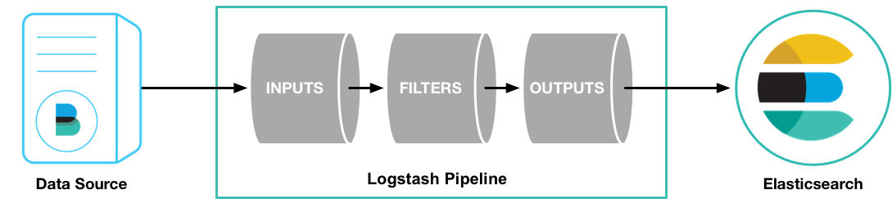
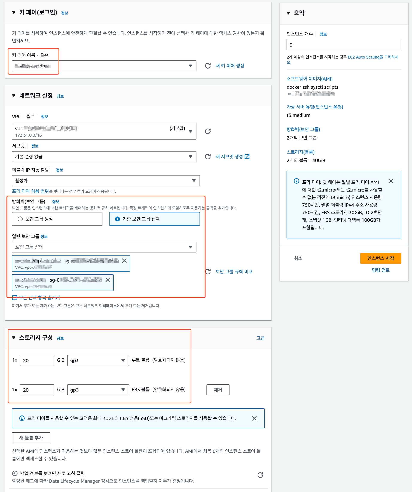
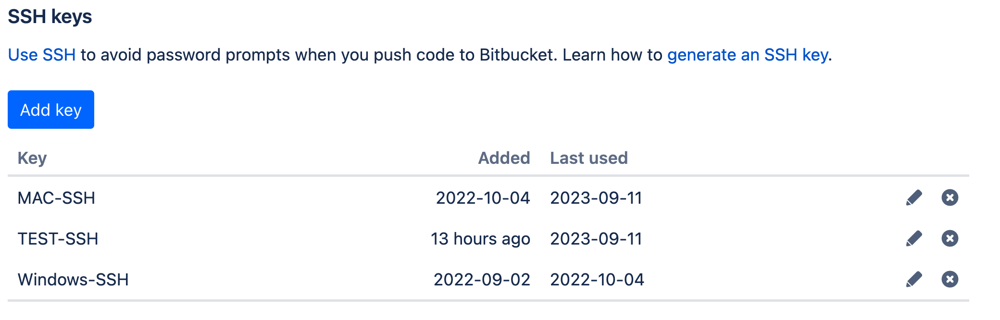

# [AWS EC2] Docker Swarm 기반의 멀티 노드 ELK 환경 구성

[Elastic Stack](https://www.elastic.co/products) _(v7.10.2 by default)_

<p align="center">
  
</p>

* [Docker swarm mode](https://docs.docker.com/engine/swarm/)로 구성
* 모든 컨테이너화된 사용자 정의 애플리케이션은 로그를 Elastic Stack으로 보내기 위해 [GELF](http://docs.graylog.org/en/2.2/pages/gelf.html) 로그 드라이버 로 시작하도록 설계됨

### 📌 Docker Swarm 참고

- https://docs.docker.com/engine/swarm/
- https://velog.io/@lijahong/series/0%EB%B6%80%ED%84%B0-%EC%8B%9C%EC%9E%91%ED%95%98%EB%8A%94-Docker-Swarm-%EA%B3%B5%EB%B6%80
- https://seongjin.me/tag/docker/
- https://javacan.tistory.com/entry/docker-start-toc
- https://velog.io/@dustndus8/series/%ED%81%B4%EB%9D%BC%EC%9A%B0%EB%93%9C-Docker
- https://velog.io/@korjsh/%EB%8F%84%EC%BB%A4%EC%8A%A4%EC%9B%9C-%EA%B8%B0%EC%B4%88-%EB%B0%8F-%EC%98%88%EC%A0%9C
- https://medium.com/dtevangelist/docker-%EA%B8%B0%EB%B3%B8-7-8-docker-swarm%EC%9D%98-%EA%B5%AC%EC%A1%B0%EC%99%80-service-%EB%B0%B0%ED%8F%AC%ED%95%98%EA%B8%B0-1d5c05967b0d
- 원본 출처
  - https://github.com/shazChaudhry/docker-elastic
- 참고
  - https://github.com/elastic/stack-docker
  - https://github.com/sadok-f/ELK-Stack-logging-demo
  - https://github.com/deviantony/docker-elk
  - https://github.com/deviantony/docker-elk/wiki/Elasticsearch-cluster
  - https://github.com/netman2k/docker-elasticsearch-swarm
  - https://github.com/jakubhajek/elasticsearch-docker-swarm
  - https://gist.github.com/YildirimMehmet/69dd7fd38f96639f004eab1fc22b550a


<!-- TOC -->
- [\[AWS EC2\] Docker Swarm 기반의 멀티 노드 ELK 환경 구성](#aws-ec2-docker-swarm-기반의-멀티-노드-elk-환경-구성)
    - [📌 Docker Swarm 참고](#-docker-swarm-참고)
  - [🚦 Architecture](#-architecture)
  - [🚦 Spac](#-spac)
  - [🚦 EC2 Incetence Configuration](#-ec2-incetence-configuration)
    - [📕 1. 초기 인스턴스 설정](#-1-초기-인스턴스-설정)
      - [► 0. AMI로 인스턴스 생성](#-0-ami로-인스턴스-생성)
      - [► 1. 추가 볼륨 마운트 (`volume-mount.sh`)](#-1-추가-볼륨-마운트-volume-mountsh)
      - [► 2. host 설정 (`set-host.sh`)](#-2-host-설정-set-hostsh)
      - [► 3. BitBucket SSH 키 생성 및 등록 (`set-sshkey.sh`)](#-3-bitbucket-ssh-키-생성-및-등록-set-sshkeysh)
      - [🚫️ 4. AWS 키를 `.zshrc`에 등록 (EC2 IAM Role 설정X) (`set-awskey.sh`)](#️-4-aws-키를-zshrc에-등록-ec2-iam-role-설정x-set-awskeysh)
      - [► 5. sysctl 설정 확인](#-5-sysctl-설정-확인)
  - [🚦 Docker Swarm Configuration](#-docker-swarm-configuration)
    - [📘 1. ELK 구성 스크립트 Git Clone](#-1-elk-구성-스크립트-git-clone)
    - [📘 2. Docker Swarm 초기 구축 환경 설정](#-2-docker-swarm-초기-구축-환경-설정)
      - [► 1. 초기 설정 스크립트 수행](#-1-초기-설정-스크립트-수행)
        - [환경변수 스크립트 (`env.sh`)](#환경변수-스크립트-envsh)
        - [사전 실행 스크립트 (`preload.sh`)](#사전-실행-스크립트-preloadsh)
        - [초기 셋팅 스크립트 (`init.sh`)](#초기-셋팅-스크립트-initsh)
      - [► 2. AWS CLI를 설치하고 ECR Login을 테스트](#-2-aws-cli를-설치하고-ecr-login을-테스트)
        - [ECR 로그인 스크립트 (`ecr-login.sh`)](#ecr-로그인-스크립트-ecr-loginsh)
      - [► 3. 1분마다 동작하는 Cronjob 등록](#-3-1분마다-동작하는-cronjob-등록)
        - [크론잡 실행 스크립트 (`cron-start.sh`)](#크론잡-실행-스크립트-cron-startsh)
      - [► 4. Docker Swarm 초기 설정 (`docker-swarm-init.sh`)](#-4-docker-swarm-초기-설정-docker-swarm-initsh)
    - [📘 3. Swarmpit 설치](#-3-swarmpit-설치)
        - [Swarmpit Docker Compose (`swarmpit-docker-compose.yml`)](#swarmpit-docker-compose-swarmpit-docker-composeyml)
        - [Swarmpit 배포 스크립트 (`deployStackSwarmpit.sh`)](#swarmpit-배포-스크립트-deploystackswarmpitsh)
  - [🚦 ELK Configuration](#-elk-configuration)
    - [📗 1. ELK 이미지 빌드 (최초에만 생성 이미 생성되어 있음)](#-1-elk-이미지-빌드-최초에만-생성-이미-생성되어-있음)
      - [► 1. Elasticsearch 이미지 빌드 (최초에만 생성 이미 생성되어 있음)](#-1-elasticsearch-이미지-빌드-최초에만-생성-이미-생성되어-있음)
        - [Elasticsearch (`Dockerfile`)](#elasticsearch-dockerfile)
        - [Elasticsearch 빌드 스크립트 (`buildElastic.sh`)](#elasticsearch-빌드-스크립트-buildelasticsh)
      - [► 2. Kibana 이미지 빌드 (최초에만 생성 이미 생성되어 있음)](#-2-kibana-이미지-빌드-최초에만-생성-이미-생성되어-있음)
        - [Kibana (`Dockerfile`)](#kibana-dockerfile)
        - [Kibana 빌드 스크립트 (`buildKibana.sh`)](#kibana-빌드-스크립트-buildkibanash)
    - [📗 2. ELK Stack 구축](#-2-elk-stack-구축)
      - [► 1. Elastic Stack 배포](#-1-elastic-stack-배포)
        - [Elastic Stack Docker Compose (`docker-compose.dev.yml`)](#elastic-stack-docker-compose-docker-composedevyml)
        - [Elastic Stack 배포 스크립트 (`deployStack.sh`)](#elastic-stack-배포-스크립트-deploystacksh)
        - [Elastic Stack 상태 정보 확인 (`getHealth.sh`)](#elastic-stack-상태-정보-확인-gethealthsh)
        - [Elasticsearch 접속 확인](#elasticsearch-접속-확인)
        - [Elastic Stack 중지 스크립트 (`removeStack.sh`)](#elastic-stack-중지-스크립트-removestacksh)
        - [Elastic Stack 단일 서비스 재기동](#elastic-stack-단일-서비스-재기동)
      - [► 2. Beats 일괄배포/중지](#-2-beats-일괄배포중지)
        - [Beats 일괄배포 스크립트 (`deployBeats.sh`)](#beats-일괄배포-스크립트-deploybeatssh)
        - [Beats 일괄중지 스크립트 (`removeBeats.sh`)](#beats-일괄중지-스크립트-removebeatssh)
      - [► 3. Filebeat 배포 (Beats 스크립트에 포함되서 설치됨)](#-3-filebeat-배포-beats-스크립트에-포함되서-설치됨)
        - [Filebeat Docker Compose (`filebeat-docker-compose.yml`)](#filebeat-docker-compose-filebeat-docker-composeyml)
        - [Filebeat 배포 스크립트 (`deployStackFilebeat.sh`)](#filebeat-배포-스크립트-deploystackfilebeatsh)
      - [► 4. Metricbeat 배포 (Beats 스크립트에 포함되서 설치됨)](#-4-metricbeat-배포-beats-스크립트에-포함되서-설치됨)
        - [Metricbeat Docker Compose (`metricbeat-docker-compose.yml`)](#metricbeat-docker-compose-metricbeat-docker-composeyml)
        - [Metricbeat 배포 스크립트 (`deployStackMetricbeat.sh`)](#metricbeat-배포-스크립트-deploystackmetricbeatsh)
      - [► 5. Packetbeat 배포 (Beats 스크립트에 포함되서 설치됨)](#-5-packetbeat-배포-beats-스크립트에-포함되서-설치됨)
        - [Packetbeat Docker Compose (`packetbeat-docker-compose.yml`)](#packetbeat-docker-compose-packetbeat-docker-composeyml)
        - [Packetbeat 배포 스크립트 (`deployStackPacketbeat.sh`)](#packetbeat-배포-스크립트-deploystackpacketbeatsh)
      - [► 6. Heartbeat 배포 (Beats 스크립트에 포함되서 설치됨)](#-6-heartbeat-배포-beats-스크립트에-포함되서-설치됨)
        - [Heartbeat Docker Compose (`heartbeat-docker-compose.yml`)](#heartbeat-docker-compose-heartbeat-docker-composeyml)
        - [Heartbeat 배포 스크립트 (`deployStackHeartbeat.sh`)](#heartbeat-배포-스크립트-deploystackheartbeatsh)
      - [🚫 7. Auditbeat 배포 (사용안함)](#-7-auditbeat-배포-사용안함)
  - [📌 추가 모니터링 툴](#-추가-모니터링-툴)
      - [► 1. ADD CLUSTER 클릭](#-1-add-cluster-클릭)
      - [► 2. ELK URL PORT 입력](#-2-elk-url-port-입력)
      - [► 3. 모니터링 화면](#-3-모니터링-화면)
  - [🚦 Kibana Management](#-kibana-management)
    - [📌 Stack Management (Index 용량 및 정책 관리)](#-stack-management-index-용량-및-정책-관리)
      - [► Index Policy 정책 설정](#-index-policy-정책-설정)
    - [📌 Stack Monitoring (Elasticsearch 모니터링 및 각종 지표 확인)](#-stack-monitoring-elasticsearch-모니터링-및-각종-지표-확인)
      - [► Elasticsearch 모니터링](#-elasticsearch-모니터링)
        - [Elasticsearch Overview](#elasticsearch-overview)
        - [Elasticsearch Node](#elasticsearch-node)
<!-- TOC -->
  


## 🚦 Architecture

---

<table>
  <tr>
    <th>High level design</th>
    <th>In scope</th>
    <th>Not in scope</th>
  </tr>
  <tr>
    <td></td>
    <td>
      로그 파일 및 지표에 대한 비트만 사용됨. 모든 로그와 지표는 이 리포지토리에서 직접 elasticsearch로 전달됨.
      2x Elasticsearch, 1x apm-server 및 1x Kibana가 사용됨
    </td>
    <td>수집 노드가 사용되지 않음</td>
  </tr>
  <tr>
    <td></td>
    <td>모든 컨테이너화된 사용자 정의 애플리케이션은 로그를 Elastic Stack으로 보내기 위해 GELF 로그 드라이버로 시작하도록 설계됨.</td>
    <td>-</td>
  </tr>
</table>


## 🚦 Spac

---

- Version: `7.10.2`

**▶︎ Port**

- `9200`: Elasticsearch HTTP
- `8200`: Apm Server HTTP
- `80`: Kibana
- `888`: Swarmpit (모니터링 및 Docker Swarm 관리)

**▶︎ Path**

- ES 데이터 경로: `/home/ubuntu/data/elasticsearch`
- ES 로그 경로: `/home/ubuntu/log/elasticsearch`

**▶︎ Plug-in**

- Elasticsearch
  - [analysis-icu](https://www.elastic.co/guide/en/elasticsearch/plugins/7.10/analysis-icu.html)
  - [analysis-nori: 한국어 형태소 분석기 / 7.10.2](https://esbook.kimjmin.net/06-text-analysis/6.7-stemming/6.7.2-nori)
  - [jaso-analyzer: 한글 자소 분석기 / 7.10.2](https://github.com/netcrazy/elasticsearch-jaso-analyzer)
  - [alerting v1.13.1.0](https://github.com/opendistro-for-elasticsearch/alerting/releases)
- Kibana
  - [opendistroAlertingKibana-1.13.0.0](https://github.com/opendistro-for-elasticsearch/alerting-kibana-plugin/releases)


> 기본 라이선스에 포함된 무료 기능의 전체 목록 참조: https://www.elastic.co/subscriptions


## 🚦 EC2 Incetence Configuration

---

본 구성은 AWS 에서 [초기 구성이 완료된 AMI](docs/1_init-ec2)를 바탕으로 진행한다  
AMI 환경구성을 하지 않았다면 AMI 환경구성 부터 먼저 진행하기 바란다

### 📕 1. 초기 인스턴스 설정

- 초기 인스턴스 셋팅 참고
  - [Linux(Ubuntu) AWS EC2 초기 환경 셋팅(Docker, zsh, oh-my-zsh, 테마, 랜덤 이모지 프롬프트)](docs/1_init-ec2.md)
  - [Linux(Ubuntu) AWS EC2 ELK AMI 초기 셋팅](docs/2_init-ami.md)


#### ► 0. AMI로 인스턴스 생성

ELK 서버 셋팅용 AMI 로 인스턴스 생성   

1. **Name** `[x86_64][DEV] docker-base-image-v1` **AMI로 인스턴스 시작** 클릭

ELK 서버 셋팅용 AMI 명이 `[x86_64][DEV] docker-base-image-v1` 라고 가정하고 진행


2. 이름 `[DEV][이니셜]es-master`, 인스턴스 유형 `t3.medium`, 인스턴스 개수 `3`개


3. 키페어 `elk-dev.pem`  
   보안그룹 `service_dev`, `es-cluster-dev`  
   스토리지 20GiB 추가볼륨 20 GiB (기본 8GiB 는 용량이 부족함 도커 이미지 때문에 넉넉히)



4. IAM 인스턴스 프로파일 `aws-ecr-ec2-role` 선택   
   EC2 인스턴스에 ECR 접근 권한 부여


5. 구매 옵션 `스팟 인스턴스`, 요청 유형 `일회성`  
   구축 테스트 용만 비용 절감 차원에서 `스팟 인스턴스` 로 진행


6. **인스턴스 시작** 클릭


7. 생성된 인스턴스 확인 후 두개의 인스턴스는 구분을 위해 각각 `es-cluster1`, `es-cluster2` 로 **Name** 변경
   퍼블 IPv4 주소에서 세개의 인스턴스 접속 IP 확인
   프라이빗 IP 주소도 확인 해둬야됨 `set-host.sh` 스크립트에서 사용


8. 편하게 접속 하기 위해 퍼블릭 IPv4 주소 alias 에 등록

```shell
echo "alias dsh='ssh -i ~/.ssh/aws/elk-dev.pem -l ubuntu'" >> .zshrc
echo "alias es0='dsh ${ES0_IP}'" >> .zshrc
echo "alias es1='dsh ${ES1_IP}'" >> .zshrc 
echo "alias es2='dsh ${ES2_IP}'" >> .zshrc
# .zshrc 적용
source ~/.zshrc
# es0~2 까지 순차적으로 접속해서 셋팅 iterm Toggle Broadcasting Input 활용
es0
es1
es2
```


#### ► 1. 추가 볼륨 마운트 (`volume-mount.sh`)

[volume-mount.sh](scripts/server-init/volume-mount.sh) 스크립트 파일 참고

- EBS 추가 볼륨을 gp3로 추가
- 볼륨생성시 **Docker**에 **Mount**시킬 **Directory**를 자동으로 생성


```bash
$ cd ~/scripts/server-init
$ ./volume-mount.sh
```


#### ► 2. host 설정 (`set-host.sh`)

[set-host.sh](scripts/server-init/set-host.sh) 스크립트 파일 참고

- 각 인스턴스마다 `sudo vi /etc/hosts` 에 **master**, **cluster1**, **cluster2** 호스트 명을 등록해줘야함
- **docker swarm node** 확인이 용이 하도록 각 서버의 `hostname`을 변경
- 변경시 `cat /etc/hostname` 변경됨 확인

```bash
$ cd ~/scripts/server-init
# master 설정 예시
$ ./set-host.sh master 10.10.0.1 10.10.0.2 10.10.0.3
# cluster1 설정 예시
$ ./set-host.sh cluster1 10.10.0.1 10.10.0.2 10.10.0.3
# cluster2 설정 예시
$ ./set-host.sh cluster2 10.10.0.1 10.10.0.2 10.10.0.3
```


#### ► 3. BitBucket SSH 키 생성 및 등록 (`set-sshkey.sh`)

본 예제는 **BitBucket** 으로 진행했으므로 **BitBucket** 사용을 기준으로 설명한다

다른 Git 서비스 사용자는 해당 Git 서비스에 맞게 셋팅하면 된다

[set-sshkey.sh](scripts/server-init/set-sshkey.sh) 스크립트 파일 참고

**Settings - Personal BitBucket setting - SECURITY - SSH Keys - Add Key**




```bash
$ cd ~/scripts/server-init
$ ./set-sshkey.sh

>> cat ~/.ssh/id_ed25519.pub
ssh-ed25519 AAAAAAAAAAAAAAAAAAAAAAAAAAAAAAAAAAAAAAAAAAAAAAAAAAAAAAAAAAAAAAAAAAAA ubuntu@master
```


#### 🚫️ 4. AWS 키를 `.zshrc`에 등록 (EC2 IAM Role 설정X) (`set-awskey.sh`)

~~**EC2 IAM Role**로 권한을 주면 보안에 취약한 **AWS KEY**를 생성/사용할 필요가 없음~~

[set-awskey.sh](scripts/server-init/set-awskey.sh) 스크립트 파일 참고

- `AWS_ACCESS_KEY_ID`: AAAAAAAAAAAAAAAAAAAA
- `AWS_SECRET_ACCESS_KEY`: dddddddddddddddddddddddddddddddddddddddd


```bash
$ cd ~/scripts
$ ./set-awskey.sh AAAAAAAAAAAAAAAAAAAA dddddddddddddddddddddddddddddddddddddddd
```


#### ► 5. sysctl 설정 확인

**인스턴스 AMI**에 미리 셋팅되어 있으므로 `/etc/sysctl.conf` 적용이 잘되어있는지 확인만 하면됨

```bash
$ cat /etc/sysctl.conf
vm.max_map_count=262144
fs.file-max=131072
vm.swappiness=1

$ sysctl vm.max_map_count
vm.max_map_count=262144
$ sysctl fs.file-max
fs.file-max=131072
$ sysctl vm.swappiness
vm.swappiness=1
```


## 🚦 Docker Swarm Configuration

---

### 📘 1. ELK 구성 스크립트 Git Clone

home에서 git clone 하여 구축환경 구성

```bash
$ cd ~
$ git clone https://github.com/freelife1191/docker-elastic.git
```


### 📘 2. Docker Swarm 초기 구축 환경 설정


#### ► 1. 초기 설정 스크립트 수행
- `init.sh` 여기서는 이 스크립트만 수행하면 됨
  - `env.sh` 에는 해당 서버에 설정에 필요한 각종 변수들을 보관하고 있으니 참고만 하면 됨
  - `preload.sh` 는 `init.sh` 를 수행하면 사전 처리되는 스크립트

##### 환경변수 스크립트 (`env.sh`)

- [env.sh](env.sh)

##### 사전 실행 스크립트 (`preload.sh`)

- [preload.sh](scripts/preload.sh)

##### 초기 셋팅 스크립트 (`init.sh`)

- [init.sh](scripts/init.sh)


**내부통신 방화벽 추가**

- 도커 스웜 모드 매니저 노드의 기본포트(TCP): 2377
- 작업자 노드 간의 통신(TCP/UDP): 7946
- 인그레스 오버레이 네트워크(TCP/UDP): 4789
- Elasticsearch 전송 포트: 9300 ~ 9399
- Elasticsearch HTTP 포트: 9200 ~ 9299
- Logstash Beats input: 5044
- Logstash TCP input: 50000
- Logstash monitoring API: 9600
- Logstash Container log Transfer: 12201
- Kibana: 5601

> 초기 환경 변수는 `init.sh` 스크립트에서 `env-template.sh` 파일을 참고하여 `env.sh`를 생성 설정  
수정할 부분이 있다면 스크립트 파일의 환경변수를 수정

```shell
$ cd scripts

# 개발환경 초기 셋팅 예시 운영환경 초기 셋팅은 Argument로 'prod' 를 입력
# 설정된 환경변수 값과 Docker Swarm Join Key가 출력된다
$ ./init.sh

SET OK
HOME=/home/ubuntu/docker-elastic
PROFILE=dev
UID=1000
ELASTIC_VERSION=7.10.2
ELASTICSEARCH_USERNAME=elastic
ELASTICSEARCH_PASSWORD=elastic
SWARMPIT_ADMIN_USERNAME=admin
SWARMPIT_ADMIN_PASSWORD=admin
ELASTICSEARCH_HOST=master
KIBANA_HOST=master
CLUSTER1_HOST=cluster1
CLUSTER2_HOST=cluster2
INITIAL_MASTER_NODES=master
ELASTICSEARCH_JVM_MEMORY=1g
ELASTICSEARCH_UPDATE_DELAY=60s
AWS_ECR_PRIVATE_DOMAIN=3XXXXXXXXXXX.dkr.ecr.ap-northeast-2.amazonaws.com
```


#### ► 2. AWS CLI를 설치하고 ECR Login을 테스트

AWS 인스턴스에서 **Elastic Container Registry** 서비스의 **Private Repository**를 사용하기 위해서는 **ECR Login** 처리가 필요한데  
한번 로그인 시 12시간이 유지되므로 주기적으로 **ECR Login** 처리를 해주어 Login 상태를 유지해줘야함

##### ECR 로그인 스크립트 (`ecr-login.sh`)

[ecr-login.sh](scripts/ecr-login.sh) 스크립트 파일 참고


#### ► 3. 1분마다 동작하는 Cronjob 등록

해당 스크립트의 상단에 있는 스크립트를 설정에 맞게 복사해서 crontab 에 붙여 넣으면됨

```bash
# crontab 편집기 모드 열기
$ crontab -e

# 1분마다 cron-start.sh 실행
*/1 * * * * sudo -u ubuntu /home/ubuntu/docker-elastic/scripts/cron-start.sh 2>&1 | tee /home/ubuntu/docker-elastic/crontab.log
```

##### 크론잡 실행 스크립트 (`cron-start.sh`)

아래의 **CronJob** 들을 수행

- [ECR 로그인](scripts/ecr-login.sh)
- Kibana ECR 이미지 Pull
- Elasticsearch ECR 이미지 Pull
- ELK 스크립트 Repository Git Pull

[cron-start.sh](scripts/cron-start.sh) 스크립트 파일 참고


#### ► 4. Docker Swarm 초기 설정 (`docker-swarm-init.sh`)

docker swarm 활성화 확인

```bash
$ docker info | grep Swarm
Swarm: inactive
```


master 노드에서만 실행한다 (worker 노드들은 Join 되면 자동으로 전파됨)

```shell
$ ./docker-swarm-init.sh
```

[docker-swarm-init.sh](scripts/docker-swarm-init.sh) 스크립트 파일 참고


```shell
Swarm initialized: current node (yky9nyzqwe82vc1ofu4grnbyz) is now a manager.

To add a worker to this swarm, run the following command:

    # 각 워커 노드에서 아래의 명령어로 하나의 클러스터로 합류 시킬 수 있음
    # 아래의 스크립트를 복사해서 master 를 제외한 각 worker 노드 서버에서 실행시켜 준다
    docker swarm join --token SWMTKN-1-36c3nveukaxto9rhcl1kiul71t18kowritmr4534q7h3qbwvmy-aydkxf0l89w70hh4s6ylrxwk9 10.10.0.1:2377

To add a manager to this swarm, run 'docker swarm join-token manager' and follow the instructions.
```

`init.sh` 스크립트를 수행해서 생성된 `docker swarm join` 스크립트를 복사해서 각 노드 서버에서 실행시켜 주면 각 노드 서버가 **Docker Swarm** 의 **Worker** 노드로 합류된다 

매니저 노드에서 작업자 노드의 연결을 확인

```bash
$ docker node ls
ID                            HOSTNAME   STATUS    AVAILABILITY   MANAGER STATUS   ENGINE VERSION
xn2sqzj4kha5kr213o1phgcng     cluster1   Ready     Active                          24.0.6
aukawhrswdwtvjawv2in2so4a     cluster2   Ready     Active                          24.0.6
kx16jv30usuni5kdej14whqpd *   master     Ready     Active         Leader           24.0.6
```

매니저 노드가 1개일때 매니저 노드가 장애가 나면 크리티컬한 문제가 발생하므로 모든 작업자 노드를 매니저 노드로 승격시킨다  
작업자 노드를 매니저 노드로 승격 시키면 **Manager Status**가 **Reachable** 표시 된다

이렇게 설정 해두면 **master** 매니저 노드가 사용불능 상태일때 **Docker Swarm**이 빠르게 판단하여 **Reachable** 상태의 매니저 노드를 **Leader**로 승격 시킨다

```bash
# docker node cluster1을 작업자 노드에서 매니저 노드로 승격
$ docker node promote cluster1
# docker node cluster2을 작업자 노드에서 매니저 노드로 승격
$ docker node promote cluster2

$ docker node ls
ID                            HOSTNAME   STATUS    AVAILABILITY   MANAGER STATUS   ENGINE VERSION
xn2sqzj4kha5kr213o1phgcng     cluster1   Ready     Active         Reachable        24.0.6
aukawhrswdwtvjawv2in2so4a     cluster2   Ready     Active         Reachable        24.0.6
kx16jv30usuni5kdej14whqpd *   master     Ready     Active         Leader           24.0.6
```

스웜 모드 상태 조회에서 활성화 상태와 도커 스웜 모드 세부 정보 확인
```bash
$ docker info
 ...
 Swarm: active
  NodeID: avphq49o2b83u480oe7srxl80
  Is Manager: true
  ClusterID: 2z8rls8vew0x32qwszdel8i12
  Managers: 1
  Nodes: 4
  Default Address Pool: 10.0.0.0/8
  SubnetSize: 24
  Data Path Port: 4789
  Orchestration:
   Task History Retention Limit: 5
  ...
```

docker swarm 활성화 다시 확인

```bash
$ docker info | grep Swarm
Swarm: active
```


### 📘 3. Swarmpit 설치

Docker Swarm 모니터링 오픈소스  
https://swarmpit.io


도커 스웜피트 접속 주소 http://PUBLIC_IP:888 패스워드는 스크립트에 설정되어 있으니 참고

현재 사용중인 모든 클러스터 노드의 서비스 컨테이너 정보를 확인  
다양한 메뉴를 가지고 있고 대시보드를 통해 전체 자원 사용량 체크  
실행 중인 특정 서비스의 세부 정보까지 확인

> 한가지 단점이 있다면 Swarmpit Timezone 설정을 변경할 수 없어서 UTC 기준으로 볼 수 밖에 없다


##### Swarmpit Docker Compose (`swarmpit-docker-compose.yml`)

[swarmpit-docker-compose.yml](swarmpit-docker-compose.yml) docker compose 설정 참고


##### Swarmpit 배포 스크립트 (`deployStackSwarmpit.sh`)

[deployStackSwarmpit.sh](deployStackSwarmpit.sh) 스크립트 참고

```bash
$ ./deployStackSwarmpit.sh
```

**Docker Swarmpit**는 **Docker Stack**으로 구동되며 `app`, `agent`, `db`, `influxdb`의 4개 스택으로 구성되어 있음

```bash
$ docker stack ps --no-trunc swarmpit
```


## 🚦 ELK Configuration

---

### 📗 1. ELK 이미지 빌드 (최초에만 생성 이미 생성되어 있음)


플러그인 설치를 위해 기본 이미지에 플러그인을 설치한 별도의 Docker 이미지를 생성하여 `ECR`에 PUSH


#### ► 1. Elasticsearch 이미지 빌드 (최초에만 생성 이미 생성되어 있음)

스크립트 파일 참고

##### Elasticsearch (`Dockerfile`)

[elk/elasticsearch/Dockerfile](elk/elasticsearch/Dockerfile)

##### Elasticsearch 빌드 스크립트 (`buildElastic.sh`)

[buildElastic.sh](scripts/buildElastic.sh)

```bash
$ cd scripts
$ ./buildElastic.sh
```


#### ► 2. Kibana 이미지 빌드 (최초에만 생성 이미 생성되어 있음)


##### Kibana (`Dockerfile`)

[elk/kibana/Dockerfile](elk/kibana/Dockerfile) 스크립트 파일 참고


##### Kibana 빌드 스크립트 (`buildKibana.sh`)

[buildKibana.sh](scripts/buildKibana.sh) 스크립트 파일 참고

```bash
$ cd scripts
$ ./buildKibana.sh
```


### 📗 2. ELK Stack 구축


#### ► 1. Elastic Stack 배포

##### Elastic Stack Docker Compose (`docker-compose.dev.yml`)

[docker-compose.dev.yml](docker-compose.dev.yml) 스크립트 파일 참고


##### Elastic Stack 배포 스크립트 (`deployStack.sh`)

[deployStack.sh](deployStack.sh) 스크립트 파일 참고

**elastic stack 배포**
- `elasticsearch`
- `logstash`
- `kibana`
- `swarm-listener`
- `proxy`
- `apm-server`

```bash
$ ./deployStack.sh
```

배포 서비스 확인

```bash
$ ./docker stack services elastic
```

배포 로그 확인

```bash
$ ./docker stack ps --no-trunc elastic
```

##### Elastic Stack 상태 정보 확인 (`getHealth.sh`)

[getHealth.sh](getHealth.sh) 스크립트 파일 참고

```bash
$ ./getHealth.sh

=== health ===
epoch      timestamp cluster status node.total node.data shards pri relo init unassign pending_tasks max_task_wait_time active_shards_percent
1694760889 06:54:49  elastic green           3         3     20  13    0    0        0             0                  -                100.0%

=== indices ===
health status index                            uuid                   pri rep docs.count docs.deleted store.size pri.store.size
green  open   apm-7.10.2-metric-000001         vE45PtuYQ_Sxp1WYz5AC_A   1   0          0            0       208b           208b
green  open   apm-7.10.2-transaction-000001    VdZ5Fn6tTnOVsYLtpUwYiQ   1   0          0            0       208b           208b
green  open   apm-7.10.2-span-000001           4LIyhK46QaWyzphQD1OSsw   1   0          0            0       208b           208b
green  open   .apm-custom-link                 5TnLPBqdRBitAl44xEBQwQ   1   1          0            0       416b           208b
green  open   .kibana_task_manager_1           F71pJqmOT2Gj-oJ52t_eNQ   1   1          5           39    155.3kb         58.5kb
green  open   apm-7.10.2-onboarding-2023.09.15 KZ-0LDHrTVGy3IZ4DKB0Ew   1   0          1            0        7kb            7kb
green  open   .apm-agent-configuration         xxoapfJBRQSAiBBArEA2EQ   1   1          0            0       416b           208b
green  open   apm-7.10.2-profile-000001        u9J_K8UnTJiOMurk-iTWzA   1   0          0            0       208b           208b
green  open   logstash-2023.09.15-000001       Pp7pZxbdS6OwYk9_QqcPww   1   1          0            0       416b           208b
green  open   .kibana_1                        Af5G0poQQS2haHpGv3N1qw   1   1       2143         2356      6.7mb          3.3mb
green  open   .kibana-event-log-7.10.2-000001  2p8FQ0LORIGomGKlVbuWsg   1   1          1            0     11.2kb          5.6kb
green  open   apm-7.10.2-error-000001          -JSbO-hPQZioO9HwgSDINA   1   0          0            0       208b           208b
```


##### Elasticsearch 접속 확인 

http://PUBLIC_IP:9200

```json
{
  "name" : "es-master",
  "cluster_name" : "elastic",
  "cluster_uuid" : "v6uJ4de1T9W7Xbegh_p9TQ",
  "version" : {
    "number" : "7.10.2",
    "build_flavor" : "default",
    "build_type" : "docker",
    "build_hash" : "747e1cc71def077253878a59143c1f785afa92b9",
    "build_date" : "2021-01-13T00:42:12.435326Z",
    "build_snapshot" : false,
    "lucene_version" : "8.7.0",
    "minimum_wire_compatibility_version" : "6.8.0",
    "minimum_index_compatibility_version" : "6.0.0-beta1"
  },
  "tagline" : "You Know, for Search"
}
```

##### Elastic Stack 중지 스크립트 (`removeStack.sh`)

- [removeStack.sh](removeStack.sh) 스크립트 파일 참고

```bash
$ ./removeStack.sh
```


##### Elastic Stack 단일 서비스 재기동

```bash
$ docker service update --force --with-registry-auth stack_service_name
```

kibana 재기동 예시

```bash
$ docker service update --force --with-registry-auth elastic_kibana
```


#### ► 2. Beats 일괄배포/중지


##### Beats 일괄배포 스크립트 (`deployBeats.sh`)

[deployBeats.sh](deployBeats.sh) Beats 일괄배포

Beats 일괄배포

```bash
$ ./deployBeats.sh
```


##### Beats 일괄중지 스크립트 (`removeBeats.sh`)

[removeBeats.sh](removeBeats.sh) Beats 일괄중지

Beats 일괄중지

```bash
$ ./removeBeats.sh
```


#### ► 3. Filebeat 배포 (Beats 스크립트에 포함되서 설치됨)

https://www.elastic.co/kr/beats/filebeat


##### Filebeat Docker Compose (`filebeat-docker-compose.yml`)

[filebeat-docker-compose.yml](filebeat-docker-compose.yml) 스크립트 파일 참고


##### Filebeat 배포 스크립트 (`deployStackFilebeat.sh`)

[deployStackFilebeat.sh](deployStackFilebeat.sh) filebeat stack 배포

```bash
$ ./deployStackFilebeat.sh
```

Filebeat 중지

```bash
$ docker stack rm filebeat
```


#### ► 4. Metricbeat 배포 (Beats 스크립트에 포함되서 설치됨)

https://www.elastic.co/kr/beats/metricbeat


##### Metricbeat Docker Compose (`metricbeat-docker-compose.yml`)

[metricbeat-docker-compose.yml](metricbeat-docker-compose.yml) 스크립트 파일 참고


##### Metricbeat 배포 스크립트 (`deployStackMetricbeat.sh`)

[deployStackMetricbeat.sh](deployStackMetricbeat.sh) metricbeat stack 배포

```bash
$ ./deployStackMetricbeat.sh
```

Metricbeat 중지

```bash
$ docker stack rm metricbeat
```


#### ► 5. Packetbeat 배포 (Beats 스크립트에 포함되서 설치됨)

https://www.elastic.co/kr/beats/packetbeat


##### Packetbeat Docker Compose (`packetbeat-docker-compose.yml`)

[packetbeat-docker-compose.yml](packetbeat-docker-compose.yml) 스크립트 파일 참고


##### Packetbeat 배포 스크립트 (`deployStackPacketbeat.sh`)

[deployStackPacketbeat.sh](deployStackPacketbeat.sh) packetbeat stack 배포

```bash
$ ./deployStackPacketbeat.sh
```

Packetbeat 중지

```bash
$ docker stack rm packetbeat
```


#### ► 6. Heartbeat 배포 (Beats 스크립트에 포함되서 설치됨)

https://www.elastic.co/kr/beats/heartbeat


##### Heartbeat Docker Compose (`heartbeat-docker-compose.yml`)

[heartbeat-docker-compose.yml](heartbeat-docker-compose.yml) 스크립트 파일 참고


##### Heartbeat 배포 스크립트 (`deployStackHeartbeat.sh`)

[deployStackHeartbeat.sh](deployStackHeartbeat.sh) heartbeat stack 배포

```bash
$ ./deployStackHeartbeat.sh
```

Heartbeat 중지

```bash
$ docker stack rm heartbeat
```


#### 🚫 7. Auditbeat 배포 (사용안함)

**Auditbeat**는 `pid` 설정 문제로 **Docker Swarm**으로 구동하기 힘들고 각각 서버에서 단독으로 구성해줘야 됨

https://www.elastic.co/kr/beats/auditbeat

- [auditbeat-docker-compose.yml](auditbeat-docker-compose.yml) 스크립트 파일 참고
- [deployStackAuditbeat.sh](deployStackAuditbeat.sh) auditbeat stack 배포

```bash
$ ./deployStackAuditbeat.sh
```


## 📌 추가 모니터링 툴

---

https://chromewebstore.google.com/detail/elasticvue/hkedbapjpblbodpgbajblpnlpenaebaa

#### ► 1. ADD CLUSTER 클릭


#### ► 2. ELK URL PORT 입력


#### ► 3. 모니터링 화면


## 🚦 Kibana Management

---

### 📌 Stack Management (Index 용량 및 정책 관리)


**Kibnana - Management - Stack Management** 에서 index 관리
index 정책 설정 및 전반적인 관리를 할 수 있음


#### ► Index Policy 정책 설정

모니터링 관련된 index 에는 많은 양의 데이터가 쌓이므로 주기적으로 삭제 처리하여 용량을 비워준다  
**Stack Management - Index Lifecycle Policies**


여기서 아래와 같이 삭제 정책 생성 한다


생성된 삭제 정책은 **Index Management - Indicies** 에서 적용할 수 있다


적용된 삭제 정책은 **Index Management - Index Templates** 에서 확인할 수 있다


### 📌 Stack Monitoring (Elasticsearch 모니터링 및 각종 지표 확인)


주로 확인하는 지표들은 아래와 같다  
로그, 매트릭, 서버 구동 상태, 서버 리소스 및 처리상태 모니터링
**Observability - Overview, Logs, Metrics, Uptime**


**Management - Stack Monitoring**


#### ► Elasticsearch 모니터링

**Stack Monitoring - Elasticsearch, Kibana, Logstash, Beats** 각각의 요소들을 클릭해 그래프와 상세 지표 확인이 가능하다

##### Elasticsearch Overview


##### Elasticsearch Node

Node 정보의 상세 CPU 지표를 확인하기 위해서는 Advanced 탭을 클릭해서 확인해야된다 (Docker Container 로 구동중이라 Overview 탭에서는 확인이 안된다)

현재 마스터 Node 는 **★** 표시가 되어 있으며 상세 지표들을 확인하고 싶으면 각 Node 를 클릭해서 확인하면 된다


