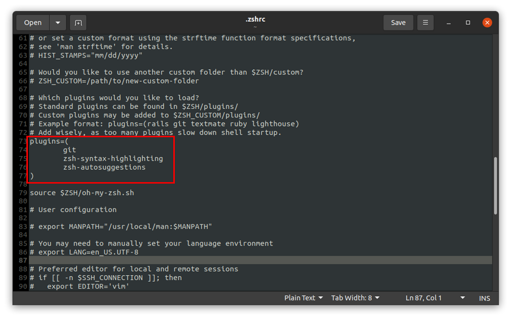
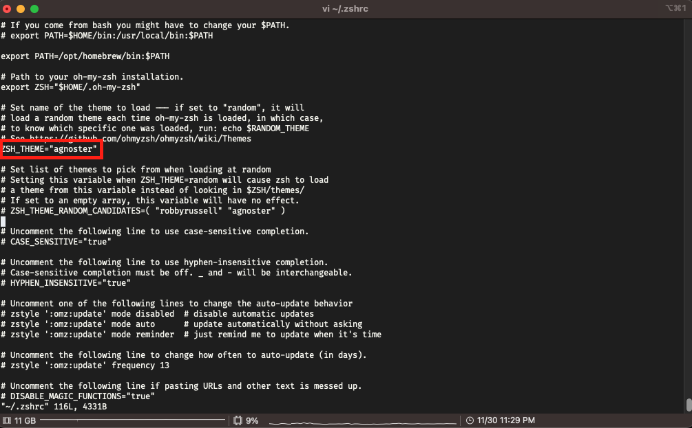

# Linux(Ubuntu) AWS EC2 초기 환경 셋팅(Docker, zsh, oh-my-zsh, 테마, 랜덤 이모지 프롬프트)


<!-- TOC -->
* [Linux(Ubuntu) AWS EC2 초기 환경 셋팅(Docker, zsh, oh-my-zsh, 테마, 랜덤 이모지 프롬프트)](#linuxubuntu-aws-ec2-초기-환경-셋팅docker-zsh-oh-my-zsh-테마-랜덤-이모지-프롬프트)
  * [🚦 0. 기본 설정 및 패키지 설치](#-0-기본-설정-및-패키지-설치)
  * [🚦 1. Docker 설치](#-1-docker-설치)
  * [🚦 2. DCS 툴 설치](#-2-dcs-툴-설치)
  * [🚦 3. zsh 설치](#-3-zsh-설치)
  * [🚦 4. oh-my-zsh 설치](#-4-oh-my-zsh-설치)
  * [🚦 5. 플러그인 설치](#-5-플러그인-설치)
  * [🚦 6. 테마 변경](#-6-테마-변경)
  * [🚦 7. alias 추가](#-7-alias-추가)
  * [🚦 8. 프롬프트 수정](#-8-프롬프트-수정)
<!-- TOC -->


아래의 설정 내용을 모두 반영 하여 기본 셋팅을 해놓은 AMI 이미지를 만들어 두고 사용하면 매우 편리하다

## 🚦 0. 기본 설정 및 패키지 설치

---

**카카오 미러 서버로 변경**

```bash
sudo sed -i 's/kr.archive.ubuntu.com/mirror.kakao.com/g' /etc/apt/sources.list
```

**ubuntu 업데이트 및 업그레이드**

```bash
sudo apt update && sudo apt upgrade -y && sudo apt autoclean
```

필수 패키지 설치 `vim`, `systemctl`, `ssh`, `net-tools`
ssh의 경우에는 AWS EC2 인스턴스에는 기본적으로 설치되어있으므로 설치불필요

```bash
$ sudo apt install vim -y \
  && sudo apt install systemctl -y \
  && sudo apt install ssh -y \
  && sudo apt install net-tools -y
```


## 🚦 1. Docker 설치

---

- https://github.com/docker/docker-install
- https://docs.docker.com

아래의 커맨드를 입력하면 자동으로 해당 OS에 맞게 도커를 설치 해줌  
Amazone Linux 는 별도의 설치 커맨드로 설치해야됨

```bash
$ curl -s https://get.docker.com/ | sudo sh
```

**도커 그룹 추가**

```bash
# 그룹확인
$ cat /etc/group

# docker 유저 추가
$ sudo usermod -aG docker $USER && \
sudo service docker restart
```

도커 그룹 추가후 ssh 접속을 끊고 재접속 후 버전을 확인 한다(재접속시 적용됨)


**docker 및 docker compose 버전 확인**

```bash
$ docker version
$ docker compose version
```


## 🚦 2. DCS 툴 설치

---

**DCS 설명**

Docker를 쉽게 사용할 수 있게 해주는 유용한 툴

**GitHub 주소**: https://github.com/goody80/docker_cli_dashboard


**설치 커맨드**

```bash
$ curl -sL bit.ly/ralf_dcs -o ./dcs && \
chmod 755 dcs && \
sudo mv dcs /usr/local/bin/dcs
```


## 🚦 3. zsh 설치

---

```bash
# zsh 설치
$ sudo apt-get install zsh
```

**기본 쉘 변경**

```bash
# 설정된 기본 쉘 확인
$ echo $SHELL
/bin/bash

# 기본 쉘 변경: BASH에서 zsh로
$ sudo chsh -s $(which zsh)

# 변경된 기본 쉘 확인
$ echo $SHELL
/bin/zsh
```


## 🚦 4. oh-my-zsh 설치

---

```bash
# oh-my-zsh 설치
$ sh -c "$(curl -fsSL https://raw.githubusercontent.com/ohmyzsh/ohmyzsh/master/tools/install.sh)"
```


## 🚦 5. 플러그인 설치

---

```bash
# 명령어 하이라이팅 플러그인 설치
$ git clone https://github.com/zsh-users/zsh-syntax-highlighting.git ${ZSH_CUSTOM:-~/.oh-my-zsh/custom}/plugins/zsh-syntax-highlighting

# 자동완성 플러그인 설치
$ git clone https://github.com/zsh-users/zsh-autosuggestions $ZSH_CUSTOM/plugins/zsh-autosuggestions
```

**플러그인 적용**

```bash
plugins=(git
         zsh-syntax-highlighting
         zsh-autosuggestions
)
```




## 🚦 6. 테마 변경

---

`~/.zshrc` 파일을 열고, **ZSH\_THEME**를 `agnoster`로 변경한다.

```bash
# ZSH_THEME 변경
$ vi ~/.zshrc

# 설정 즉시 적용
$ source ~/.zshrc
```




## 🚦 7. alias 추가

---

**Docker Compose Alias**

`~/.zshrc` 에 아래의 내용을 등록하고 `source ~/.zshrc` 하면 **alias** 가 등록된다

```bash
# docker compose alias
alias dco='docker compose'
alias dcb='docker compose build'
alias dce='docker compose exec'
alias dcps='docker compose ps'
alias dcr='docker compose run'
alias dcup='docker compose up'
alias dcupbf='docker compose up --build --force-recreate'
alias dcupb='docker compose up --build'
alias dcdn='docker compose down'
alias dcdnr='docker compose down --remove-orphans'
alias dcl='docker compose logs'
alias dclf='docker compose logs -f'
# 전체 로그 보기
# https://docs.docker.com/reference/cli/docker/compose/logs/
# --no-color : 단색 출력을 생성
# --no-log-prefix: 접두사 출력 안함
#  -f, -follow: 로그 출력을 따라감
#  -t, -timestamps: 타임 스탬프 표시
#  -n --tail all: 각 컨테이너의 로그 끝부터 표시
# docker compose logs -f -t -n all
alias dclt='docker compose logs -f -t -n 100'
```


## 🚦 8. 프롬프트 수정

---

`~/.zshrc` 가장 하단에 배치

아래의 프롬프트 중 마음에 드는 프롬프트로 골라서 설정한다

**랜덤 이모지 프름프트**

```bash
prompt_context() {
  # Custom (Random emoji)
  emojis=("⚡️" "🔥" "🇰 " "👑" "😎" "🐸" "🐵" "🦄" "🌈" "🍻" "🚀" "💡" "🎉" "🔑" "🚦" "🌙")
  RAND_EMOJI_N=$(( $RANDOM % ${#emojis[@]} + 1))
  prompt_segment black default "%(!.%.)%n@%m ${emojis[$RAND_EMOJI_N]} "
}
```


**기본 프롬프트**

```bash
# Context: user@hostname (who am I and where am I)
prompt_context() {
  if [[ "$USERNAME" != "$DEFAULT_USER" || -n "$SSH_CLIENT" ]]; then
    prompt_segment black default "%(!.%.)%n@%m"
  fi
}
```


**간소화 프롬프트**

```bash
# Context: user@hostname (who am I and where am I)
prompt_context() {
  if [[ "$USERNAME" != "$DEFAULT_USER" || -n "$SSH_CLIENT" ]]; then
    prompt_segment black default "%(!.%.)$USER"
  fi
}
```