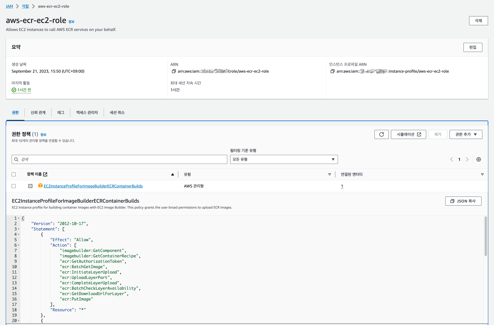
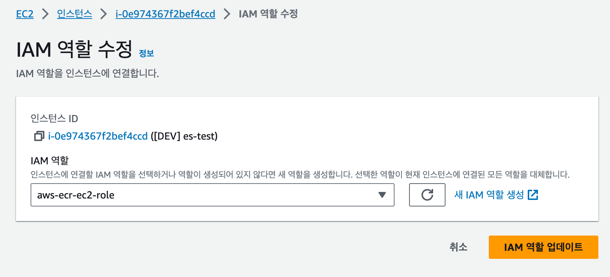

# Linux(Ubuntu) AWS EC2 ELK AMI 초기 셋팅

EC2로 ELK Docker Swarm 환경울 구성하기 위해 편의상 필요한 설정들을 사전에 설정하여 AMI로 만들어둔다


## 🚦 sysctl 설정

---

ELK 서버 셋팅할때 반드시 필요한 설정이다

sysctl 설정은 EC2 인스턴스 재부팅이 필요한 부분이므로 미리 셋팅해서 AMI로 만들어 둔다

```shell
$ sudo vi /etc/sysctl.conf

# 아래 내용을 입력하고 저장
vm.max_map_count=262144
fs.file-max=131072
vm.swappiness=1
```


## 🚦 ELK 서버용 초기 스크립트 셋팅

---

서버용 초기 스크립트를 셋팅하기 위해서 디렉토리를 생성한다

```shell
# 서버용 초기 스크립트 디렉토리 생성
$ mkdir -p ~/scripts

# 생성한 디렉토리로 이동
$ cd ~/scripts
```

디렉토리로 이동 후 아래에서 소개하는 ELK 서버 초기 셋팅 스크립트들을 모두 생성한다


#### ► 1. IP 조회 스크립트 (`get-ip.sh`) 

[`get-ip.sh`](../scripts/server-init/get-ip.sh)

```shell
#!/bin/bash

# 인스턴스 IP 정보를 쉽게 조회하기 위한 스크립트

CHECK_OS=$(uname -s)
NET_TOOLS=$(dpkg -l | grep net-tools | awk '{print $2}')
if [ -z "${NET_TOOLS}" ];then
  sudo apt install net-tools -y
fi

case "${CHECK_OS}" in
	Linux*)
      OS=${CHECK_OS}
      REGION=$(curl -s 'http://169.254.169.254/latest/meta-data/placement/region')
      if [ "$PROFILE" != "prod" ];then
        PUBLIC_IP=$(curl -s 'http://169.254.169.254/latest/meta-data/public-ipv4')
      fi
      PRIVATE_IP=$(curl -s 'http://169.254.169.254/latest/meta-data/local-ipv4')
      ;;
    *)
      OS=${CHECK_OS}
      PUBLIC_IP=$(curl -s ifconfig.me)
      PRIVATE_IP=$(hostname -i)
      #PRIVATE_IP=$(ifconfig -a | grep "inet 172*" | grep "netmask 255.255.240.0" | awk '{print $2}')
esac

echo "OS=$OS, REGION=$REGION, PUBLIC_IP=$PUBLIC_IP, PRIVATE_IP=$PRIVATE_IP"
```


#### ► 2. ELK 서버 셋팅용 초기 디렉토리 생성 스크립트 (`make-dirs.sh`)

[`make-dirs.sh`](../scripts/server-init/make-dirs.sh)

```shell
#!/bin/bash

# ELK 스택에 필요한 디렉토리 자동 생성 스크립트

HOME_DIR=$(echo ~)
DATA_DIR=${HOME_DIR}/data
LOG_DIR=${HOME_DIR}/log
echo HOME_DIR=$HOME_DIR, DATA_DIR=$DATA_DIR, LOG_DIR=$LOG_DIR
DIRS="elasticsearch kibana filebeat metricbeat packetbeat auditbeat logstash fluntd fluntbit"
for DIR in $DIRS; do
    if [ ! -d "$DATA_DIR/$DIR" ]; then
        echo "make -p $DATA_DIR/$DIR"
        mkdir -p "$DATA_DIR/$DIR"
    fi
    if [ ! -d "$LOG_DIR/$DIR" ]; then
        echo "make -p $LOG_DIR/$DIR"
        mkdir -p "$LOG_DIR/$DIR"
    fi
done
echo -e "\n=== $DATA_DIR 디렉토리 생성 확인 ==="
echo $(ls ~/data)
echo -e "\n=== $LOG_DIR 디렉토리 생성 확인 ==="
echo $(ls ~/log)
```


#### ► 3. ELK 데이터 적재용 볼륨 마운트 스크립트 (`volume-mount.sh`)

[`volume-mount.sh`](../scripts/server-init/volume-mount.sh)

```shell
#!/bin/bash

# AWS EC2 추가 볼륨 자동 마운트 스크립트
# 마운트된 드라이브는 /home/ubuntu/data 에 연결됨

MOUNT_YN=$(df -hT | grep /home/ubuntu/data)
if [ -z "$MOUNT_YN" ];then
    echo -e "\n=== 추가 볼륨 포멧 ==="
    TARGET='nvme1n1'
    ERROR_MESSAGE=$(sudo mkfs -t ext4 /dev/${TARGET} 2>&1 | grep apparently)
    if [ -n "$ERROR_MESSAGE" ];then
        EXCEPT=`echo ${ERROR_MESSAGE:0:13} | sed 's/\/dev\///g'`
        TARGET=`lsblk | grep disk | grep -v ${EXCEPT} | cut -d ' ' -f 1`
        echo ERROR_MESSAGE=$ERROR_MESSAGE, EXCEPT=$EXCEPT, TARGET=$TARGET
        echo "sudo mkfs -t ext4 /dev/${TARGET}"
        sudo mkfs -t ext4 /dev/${TARGET}
    else
        echo TARGET=$TARGET
        echo "sudo mkfs -t ext4 /dev/${TARGET}"
        sudo mkfs -t ext4 /dev/${TARGET}
    fi

    if [ ! -d "/home/ubuntu/data" ];then
        echo -e "\n=== /home/ubuntu/data 디렉토리 생성 ==="
        sudo mkdir -p /home/ubuntu/data
        ls -alt /home/ubuntu | grep data
    fi
    echo -e "\n=== 추가 볼륨 마운트 ==="
    sudo mount /dev/${TARGET} /home/ubuntu/data
    df -hT | grep /home/ubuntu/data
    echo -e "\n=== /home/ubuntu/data 소유자/그룹 변경 ==="
    sudo chown -R 1000:1000 /home/ubuntu/data
    ls -alt /home/ubuntu | grep data
fi

CHECK_FSTAB=$(cat /etc/fstab | grep /home/ubuntu/data)
if [ -z "$CHECK_FSTAB" ];then
    echo -e "\n=== 영구 볼륨 설정 추가 ==="
    sudo bash -c "echo '/dev/${TARGET}    /home/ubuntu/data        ext4   defaults,noatime 0 1' >> /etc/fstab"
    cat /etc/fstab | grep /home/ubuntu/data
fi

#if [ ! -h "/home/ubuntu/data" ];then
#    echo -e "\n=== 하드 링크 연결 ==="
#    ln -s /dev/data /home/ubuntu/data
#    ls ~/data -alt
#fi

echo -e "\n=== 마운트 연결확인 ==="
sudo blkid | grep -v "squashfs"

echo -e "\n=== Docker Mount 디렉토리 생성 ==="
bash -c "~/scripts/make-dirs.sh"
```


#### ► 4. SSH KEY 생성용 스크립트 (`set-sshkey.sh`)

[`set-sshkey.sh`](../scripts/server-init/set-sshkey.sh)

BitBucket 또는 다른 Git 서비스와의 연동을 위해 SSH KEY 등록이 필요한 경우를 대비해 서버의 SSH KEY 를 생성하는 스크립트

```shell
#!/bin/bash

# Bitbucket 용 ed25519 SSH KEY 발급

SSH_KEY_FILE="/home/ubuntu/.ssh/id_ed25519.pub"
if [ ! -e "${SSH_KEY_FILE}" ];then
    echo "sh-keygen -t ed25519 -b 256"
    ssh-keygen -t ed25519 -b 256
fi
echo -e "\n>> cat ~/.ssh/id_ed25519.pub"
cat ~/.ssh/id_ed25519.pub
```


#### ► 5. ELK 노드 셋팅을 위한 HOST 설정 스크립트 (`set-host.sh`)

[`set-host.sh`](../scripts/server-init/set-sshkey.sh)

```shell
#!/bin/bash

# master host와 hostname을 변경하는 스크립트
# argument: [hostname] [master private ip] [cluster1 private ip] [cluster2 private ip]
# 사용 예시: ./set-host.sh master 172.31.1.1 172.31.1.2 172.31.1.3

if [ -n "$1" ];then
  echo -e "\n=== hostname 등록"
  sudo hostnamectl set-hostname $1
  echo hostname=`hostname`
fi

# 모든 Arguement 대입
PRIVATE_IPS=$*
# 첫번째 Argument를 제외한 Argument
PRIVATE_IPS=${PRIVATE_IPS//$1/}

cnt=0
for PRIVATE_IP in $PRIVATE_IPS; do
    if [ $cnt -eq 0 ];then
        CLUSTER_NAME="master"
    else
        CLUSTER_NAME="cluster${cnt}"
    fi

    EXIST_CLUSTER_NAME=$(sudo cat /etc/hosts | grep ${CLUSTER_NAME})
    echo "CLUSTER_NAME=$CLUSTER_NAME, EXIST_CLUSTER_NAME=$EXIST_CLUSTER_NAME"
    if [ -n "${PRIVATE_IP}" -a -z "${EXIST_CLUSTER_NAME}" ];then
      echo -e "=== ${CLUSTER_NAME} host 등록==="
      sudo bash -c "echo '${PRIVATE_IP} ${CLUSTER_NAME}' >> /etc/hosts"
      echo $(sudo cat /etc/hosts | grep ${CLUSTER_NAME})
    fi
    cnt=$((cnt+1))
done
```


## 🚦 EC2 인스턴스 ECR 허용 정책 추가


#### ► AWS ACCESS KEY 없이 ECR Login을 처리하기 위해 EC2에 IAM Role(`aws-ecr-ec2-role`) 생성

서비스는 `EC2`로 선택하고 정책은 `EC2InstanceProfileForImageBuilderECRContainerBuilds`을 선택해서 IAM Role을 생성



생성한 **IAM Role**(`aws-ecr-ec2-role`)을 EC2에 연결하면 EC2에서 ECR 접근이 허용된다

