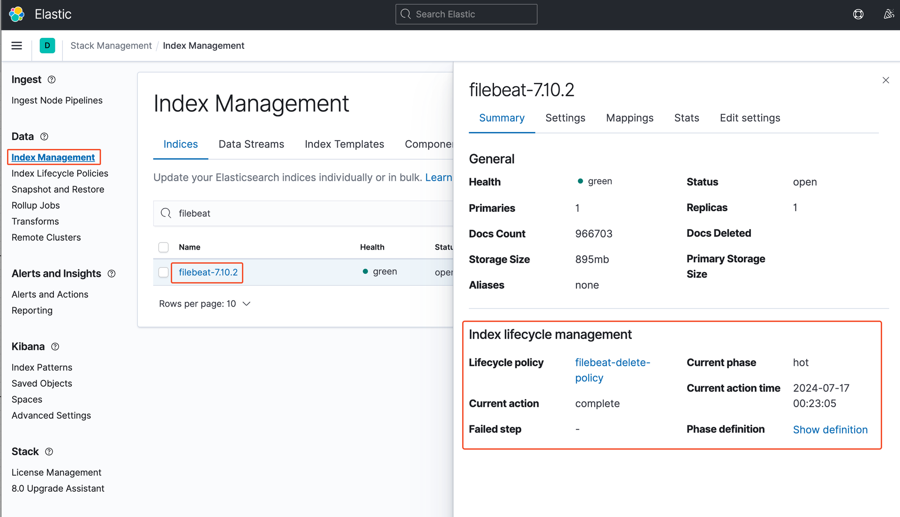

# ELK 모니터링 및 관리

<!-- TOC -->
* [ELK 모니터링 및 관리](#elk-모니터링-및-관리)
  * [📌 추가 모니터링 툴](#-추가-모니터링-툴)
      * [► 1. ADD CLUSTER 클릭](#-1-add-cluster-클릭)
      * [► 2. ELK URL PORT 입력](#-2-elk-url-port-입력)
      * [► 3. 모니터링 화면](#-3-모니터링-화면)
  * [🚦 Kibana Management](#-kibana-management)
    * [📌 Stack Management (Index 용량 및 정책 관리)](#-stack-management-index-용량-및-정책-관리)
      * [► Index Policy 정책 설정](#-index-policy-정책-설정)
    * [📌 Stack Monitoring (Elasticsearch 모니터링 및 각종 지표 확인)](#-stack-monitoring-elasticsearch-모니터링-및-각종-지표-확인)
      * [► Elasticsearch 모니터링](#-elasticsearch-모니터링)
        * [Elasticsearch Overview](#elasticsearch-overview)
        * [Elasticsearch Node](#elasticsearch-node)
<!-- TOC -->

## 📌 추가 모니터링 툴

---

구글 크롬 확장 프로그램으로 설치해서 매우 간편하게 활용할 수 있는 Elasticsearch 모니터링 툴

https://chromewebstore.google.com/detail/elasticvue/hkedbapjpblbodpgbajblpnlpenaebaa

#### ► 1. ADD CLUSTER 클릭

#### ► 2. ELK URL PORT 입력

#### ► 3. 모니터링 화면

## 🚦 Kibana Management

---

디테일한 모니터링과 Elasticsearch index 설정 및 각종 설정을 하기 위해서는 Kibana Management 기능을 사용해야 한다

### 📌 Stack Management (Index 용량 및 정책 관리)

**Kibnana - Management - Stack Management** 에서 index 관리
index 정책 설정 및 전반적인 관리를 할 수 있음

#### ► Index Policy 정책 설정

모니터링 관련된 index 에는 많은 양의 데이터가 쌓이므로 주기적으로 삭제 처리하여 용량을 비워준다  
**Stack Management - Index Lifecycle Policies**

여기서 아래와 같이 삭제 정책 생성 한다

생성된 삭제 정책은 **Index Management - Indicies** 에서 적용할 수 있다

적용된 삭제 정책은 **Index Management - Index Templates** 에서 확인할 수 있다

### 📌 Stack Monitoring (Elasticsearch 모니터링 및 각종 지표 확인)

주로 확인하는 지표들은 아래와 같다  
로그, 매트릭, 서버 구동 상태, 서버 리소스 및 처리상태 모니터링
**Observability - Overview, Logs, Metrics, Uptime**

**Management - Stack Monitoring**

#### ► Elasticsearch 모니터링

**Stack Monitoring - Elasticsearch, Kibana, Logstash, Beats** 각각의 요소들을 클릭해 그래프와 상세 지표 확인이 가능하다

##### Elasticsearch Overview

##### Elasticsearch Node

Node 정보의 상세 CPU 지표를 확인하기 위해서는 Advanced 탭을 클릭해서 확인해야된다 (Docker Container 로 구동중이라 Overview 탭에서는 확인이 안된다)

현재 마스터 Node 는 **★** 표시가 되어 있으며 상세 지표들을 확인하고 싶으면 각 Node 를 클릭해서 확인하면 된다

